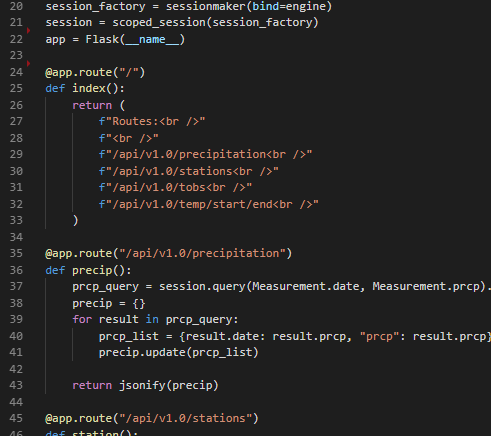
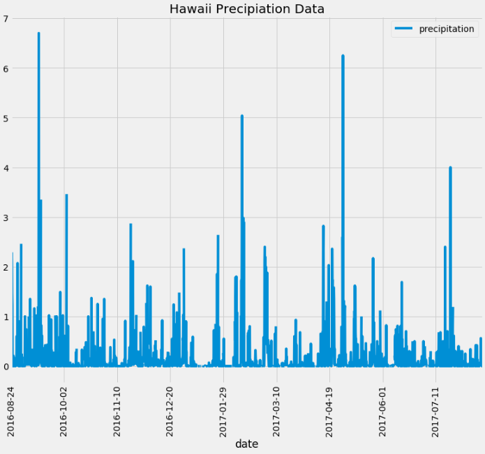
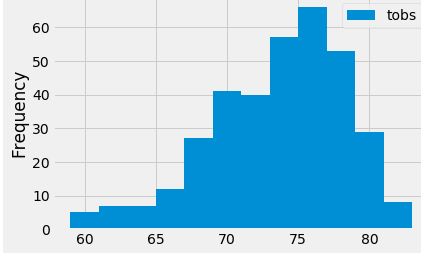
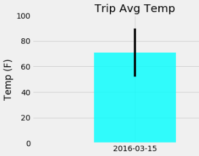

# Surfs Up!

Congratulations! You've decided to treat yourself to a long holiday vacation in Honolulu, Hawaii! To help with your trip planning, you need to do some climate analysis on the area.

## Summary (with links to my code and results)
 
* Use Python (Pandas) and SQLAlchemy ORM queries to reflect tables into a new [model](/Climate_Analysis.ipynb) and perform analysis of Hawaii climate (code snippet below). 
* Next, build a [Flask app](/climate_app.py) using the developed queries. Ensure the application has a [dynamic route](Images/Dynamic_Route.png) for the calc_temps function that can handle missing end dates from user input.

## Climate Analysis and Exploration

* Use the [hawaii.sqlite](Resources/hawaii.sqlite) file to begin the climate analysis and data exploration.

* Choose a start date and end date for your trip. Make sure that your vacation range is approximately 3-15 days total.  

* Use SQLAlchemy `create_engine` to connect to the sqlite database and `automap_base()` to reflect tables into classes and save a reference to those classes called `Station` and `Measurement`.

### Precipitation Analysis

* Design a query to retrieve the last 12 months of precipitation data, selecting only the `date` and `prcp` values.

* Load the query results into a Pandas DataFrame and set the index to the date column.

* Sort the DataFrame values by `date` and plot the results using the DataFrame `plot` method.

  

* Use Pandas to print the summary statistics for the precipitation data.

### Station Analysis

* Design a query to calculate the total number of stations and the most active stations.

  * Listed the stations and observation counts in descending order.

  * Design a query to retrieve the last 12 months of temperature observation data (tobs).

  * Filter by the station with the highest number of observations.

  * Plot the results as a histogram with `bins=12`.

    

### Temperature Analysis 

* Use a function called `calc_temps` that will accept a start date and end date in the format `%Y-%m-%d` and return the minimum, average, and maximum temperatures for a 12 month period.

* Plot the min, avg, and max temperature from your previous query as a bar chart, using the average temperature as the bar height and peak-to-peak (tmax-tmin) value as the y error bar (yerr).

    

## Climate Application

Now that the initial analysis is complete, design a Flask API based on the queries you developed.

### Flask Routes

* `/api/v1.0/precipitation`

  * Convert the query results to a Dictionary using `date` as the key and `prcp` as the value.

  * Return the JSON representation of your dictionary.

* `/api/v1.0/stations`

  * Return a JSON list of stations from the dataset.

* `/api/v1.0/tobs`

  * Query for the dates and temperature observations from a year from the last data point.

  * Return a JSON list of Temperature Observations (tobs) for the previous year.

* `/api/v1.0/<start>` and `/api/v1.0/<start>/<end>`

  * Return a JSON list of the minimum temperature, the average temperature, and the max temperature for a given start or start-end range.

  * When given the start only, `TMIN`, `TAVG`, and `TMAX` are calculated for all dates greater than and equal to the start date.

  * When given the start and the end date, `TMIN`, `TAVG`, and `TMAX` are calculated for dates between the start and end date inclusive.